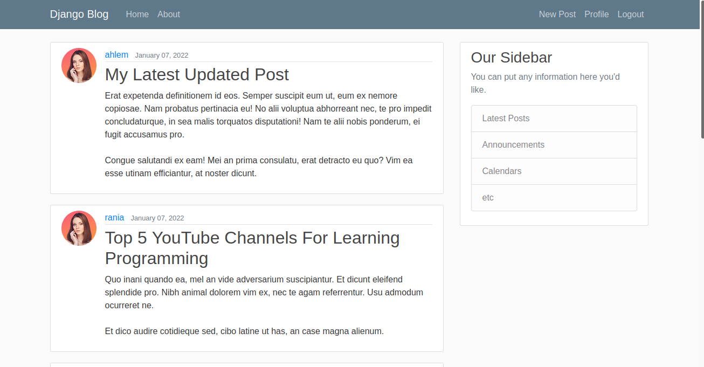
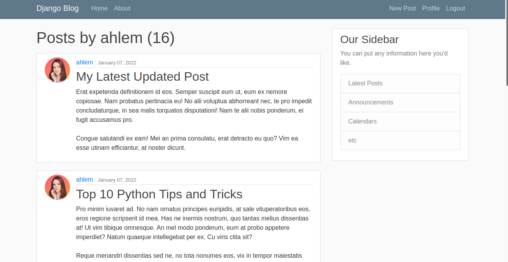

# **Blog web application**

Blog web application built with Django web framework, guide: [Django Tuorial](https://tinyurl.com/2n2vpb36)

### Contains:
* 2 applications:

    1- blog

    2- users
* CRUD operation with Django using Classes based views : `ListView, DetailView, CreateView, UpdateView, DeleteView `

* Users Authentication (login and logout)
* User Profile (create + update)
* Pagination

### Application Frontend:

